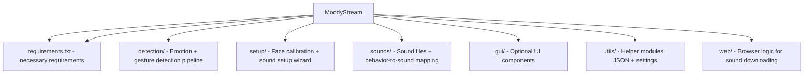

# Moody – Real-Time Emotion & Gesture Recognition with Sound Reactions

Moody is an AI-powered system that detects facial emotions and hand gestures through a webcam — and reacts by playing custom sounds.  
It is designed for streamers, creative projects, AI demos and real-time interactive applications.

Moody works in three phases:

- **Setup Phase** – Calibrate your face & assign sounds  
- **Detection Phase** – Real-time emotion + gesture recognition  
- **Reaction Phase** – Moody plays the mapped sound  


---

## Features

- DeepFace-based emotion recognition  
- MediaPipe-based gesture detection (e.g., thumbs up)  
- Custom sound assignment using an integrated browser (myinstants.com)  
- Personalized emotion baseline calibration  

---

## Project Structure

---

## How Moody Works

### Setup Phase

**Face Setup:**  
Moody guides you through multiple emotions (e.g., happy, sad, fear, surprise, neutral).  
For each emotion, the webcam captures several samples while DeepFace and FaceMesh extract features.  
Moody then computes:

- a personalized neutral baseline  
- emotion-specific statistics  
- dynamic thresholds for distinguishing real expressions  
- and a small personalized classifier (SVM with RBF Kernel)


**Sound Setup:**  
Moody opens a built-in browser window with myinstants.com.  
When you click on sounds, they are downloaded automatically and you assign them to behaviors (happy, angry, thumbsup, etc.).  
The mapping is saved so Moody knows which sound to trigger.

---

## Detection Phase

Once setup is finished:

- The webcam runs continuously  
- Emotions are detected with DeepFace  
- Gestures are detected with MediaPipe  
- A behavior is selected  
- The corresponding sound is played immediately  

---

## Sound System

All downloaded sound files are stored in:
sounds/sound_cache/

The mapping between behaviors and sounds is stored in:
sounds/sound_map.json

---

## Virtual Camera Output

Moody can optionally create a **virtual camera** as soon as the program starts.  
This allows streamers and creators to use Moody as a live video source inside other applications.

Once enabled, Moody appears in apps such as:

- OBS Studio
- Discord
- Zoom
- Twitch Studio
- Any software that accepts webcam inputs

This makes it possible to run your normal webcam feed through Moody’s real-time emotion & gesture detection, sound reactions, overlays, or any future visual output — and then simply select “Moody Virtual Camera” as the camera source in your streaming or video tool.

---

## How to Run

Install dependencies:
```
pip install -r requirements.txt
```
Start Moody:
```
python main.py
```
The setup wizard will automatically start on first run.

---

## Requirements

- Python 3.9+  
- Webcam  
- macOS / Windows / Linux  
- Internet connection only needed for sound setup  

---

## License

MIT License (or define your own)
