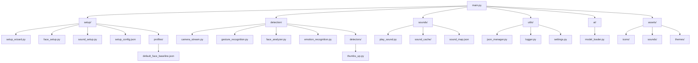

🧠 Moody – Emotion- & Gesten-Erkennung mit Soundreaktion

📖 Projektbeschreibung

Moody ist ein KI-gestütztes System, das mithilfe einer Webcam das Gesicht und Gesten einer Person analysiert.
Das Ziel: Das Programm erkennt Emotionen oder Bewegungen (z. B. Daumen hoch) und reagiert darauf mit individuell zugeordneten Sounds.

Das System besteht aus drei Hauptphasen:

Setup-Phase: Nutzer kalibriert seine Gesichtsemotionen und wählt passende Sounds aus.

Live-Erkennungsphase: Kamera erkennt Emotionen & Gesten in Echtzeit.

Reaktionsphase: Das System spielt die passenden Sounds ab.

📁 Projektstruktur (wird sich safe bisschen ändern)

⚙️ Erklärung der Module

🧭 main.py

Einstiegspunkt des Projekts.

Führt den gesamten Ablauf aus:

Startet den Setup-Wizard (Gesicht + Sounds).

Startet danach die Live-Erkennung mit Kamera.

Erkennt, ob ein Profil bereits existiert, um Setup ggf. zu überspringen.

🧩 Setup-Phase (setup/-Ordner)

🔹 setup/setup_wizard.py

Steuert den gesamten Einrichtungsablauf.

Ruft nacheinander face_setup.py und sound_setup.py auf.

Gibt am Ende True zurück, wenn alles erfolgreich abgeschlossen wurde.

🔹 setup/face_setup.py
Führt eine Gesichtskalibrierung mit DeepFace durch.

Lädt das Emotion-Modell einmalig und nutzt es für mehrere Aufnahmen.

Der Nutzer sieht ein Live-Kamerabild und drückt ENTER, um emotionale Snapshots zu speichern.

Der Durchschnitt dieser Emotionen wird als Baseline (Ruhegesicht) gespeichert:

setup/profiles/default_face_baseline.json

und in setup/setup_config.json unter dem Key "faces"

🔹 setup/sound_setup.py

Öffnet eine integrierte Browser-Ansicht mit myinstants.com.

Nutzer klickt dort manuell auf Sounds (mp3-Dateien).

Das System fängt den Download-Link ab, lädt die Datei in den Cache und fragt:

„Welchem Verhalten soll dieser Sound zugeordnet werden?“
(z. B. ok, laugh, angry, thumbsup)

Speichert Zuordnung in:

sounds/sound_cache/ (Dateien)

sounds/sound_map.json

setup/setup_config.json

Zentrale Konfigurationsdatei, die Setup-Ergebnisse speichert.

Enthält z. B.:

{
  "faces": { "happy": 0.52, "neutral": 0.33, "sad": 0.15 },
  "sounds": { "ok": "sounds/sound_cache/ok.mp3" }
}

🔹 setup/profiles/

Speichert die individuellen Face-Baseline-Dateien je Nutzer.

Format: <username>_face_baseline.json

🎥 Detection-Phase (detection/-Ordner)

🔹 camera_stream.py

Öffnet die Webcam und läuft in einer Endlosschleife.

Ruft pro Frame:

gesture_recognition.py → erkennt Gesten (z. B. Daumen hoch)
face_analyzer.py → analysiert Emotionen

Wenn eine bekannte Emotion oder Geste erkannt wird:
→ spielt über sounds/play_sound.py den passenden Sound ab.

🔹 gesture_recognition.py

Nutzt MediaPipe (mp.solutions.hands), um Handpositionen zu tracken.

Erkennt definierte Gesten über detectors/thumbs_up.py.

Gibt z. B. "thumbsup" oder None zurück.
bei weiteren Gesten Weitere dateien hinzufügen (z. B. Peace.py, Wave.py, Fist.py) die ähnluch funkitonieren sollen wie thumbsup.py

🔹 detectors/thumbs_up.py

Enthält reine Logik zur Erkennung eines „Daumen hoch“.

Wird von gesture_recognition.py genutzt.

Rückgabe: True oder False.

🔹 face_analyzer.py

Nutzt DeepFace, um Emotionen im Livebild zu erkennen.
Vergleicht aktuelle Werte mit der gespeicherten Face-Baseline.
Liefert erkannte Emotion zurück (z. B. "happy").

🔹 emotion_recognition.py

Kombiniert Gesichtsergebnisse und Gestenergebnisse.

Wählt anhand der Priorität(muss definiert werden) welcher Sound gespielt wird.

🔊 Sound-System (sounds/-Ordner)

🔹 play_sound.py

Nutzt pygame.mixer zum Abspielen von Sounds.

Bietet Funktionen wie:

play(path, volume=1.0)
stop_all()

Spielt Sounds aus sounds/sound_map.json ab, basierend auf dem erkannten Verhalten.

🔹 sound_cache/

Lokaler Speicher für heruntergeladene mp3-Dateien.

🔹 sound_map.json

Enthält die Zuordnung Emotion/Geste → Soundpfad.
Beispiel:

{
  "thumbsup": "sounds/sound_cache/ok.mp3",
  "happy": "sounds/sound_cache/laugh.mp3"
}

🧰 Hilfsmodule (utils/-Ordner)

🔹 json_manager.py

Einfaches Laden und Speichern von JSON-Dateien.

Verhindert Fehler, wenn Datei leer oder defekt ist.

🔹 settings.py

Zentrale Pfaddefinitionen und globale Konstanten (z. B. BASE_DIR, CACHE_PATH).
